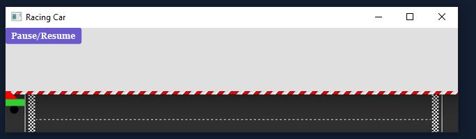

# Racing Car

The Assignment wants me to display an output of a Racing car that moves across the screen at a specific pace and
make it so that the car can increase speed or decrease using arrow keys while also drawing the racing car as it is specificed on the picture in cengage using various classes such as rectangle, polygon, circle etc.

## Output

This image will display as your example output. Name the image README.jpg in your project folder.

## Analysis Steps

Well, I analyzed it by looking at the instructions in the Cengage, it was saying to draw the car on the display, so I assumed it would be using shape classes and then obviously using scenes and panes to display it, buttons so that it could resume/stop. I basically, just looked over at the Cengage as I was programming to figure out what was required and looked in the Cengage for the classes and methods you needed to use for the various requirements.

### Design

How did you approach your program design? Did you use multiple classes to define various objects?

Yes, I used multiple classes to define the drawing of the car. I used Rectangle, Circle, and Polygon and edited the values so that they would fit
on the racetrack image that I also added to the display to make it look like its driving on a road.

### Testing

A step by step series of examples that you developed to properly test the program. 

Say what the step will be

Step one: Edit the values and run the program

This step I basically had to edit the values of the shape classes so that I could
get the perfect fit that matched the picture. This took a couple attempts but I eventually got it.

And repeat

Step Two: Mess around with the styles to get a good mix of color and add an image to the background.

This step I basically experimented with the styles as the assignment told me to do on canvas, so I experimented a little bit
with styling and I ran it over and over until I got what I liked.

And repeat

Step Three: Run the program over and over to see if it matches the description on Cengage:

Basically, I ran the program over and over making sure it did what it was supposed to do while referencing the Cengage

And I did those steps with other classes and methods as well, until I was finished.

I ended up with some data on the stylesheets, I thought you had to code it into an actual Cascading Sheet, but I looked up on the internet and found out you didn't need to
as you can see it applied on my normal code.

## Notes

Only trouble I encountered while making this is using the stylesheet to edit various things in the display, I couldn't get it to work so I just used normal code.

## Do not change content below this line
## Adapted from a README Built With

* [Dropwizard](http://www.dropwizard.io/1.0.2/docs/) - The web framework used
* [Maven](https://maven.apache.org/) - Dependency Management
* [ROME](https://rometools.github.io/rome/) - Used to generate RSS Feeds

## Contributing

Please read [CONTRIBUTING.md](https://gist.github.com/PurpleBooth/b24679402957c63ec426) for details on our code of conduct, and the process for submitting pull requests to us.

## Versioning

We use [SemVer](http://semver.org/) for versioning. For the versions available, see the [tags on this repository](https://github.com/your/project/tags). 

## Authors

* **Billie Thompson** - *Initial work* - [PurpleBooth](https://github.com/PurpleBooth)

See also the list of [contributors](https://github.com/your/project/contributors) who participated in this project.

## License

This project is licensed under the MIT License - see the [LICENSE.md](LICENSE.md) file for details

## Acknowledgments

* Hat tip to anyone who's code was used
* Inspiration
* etc
